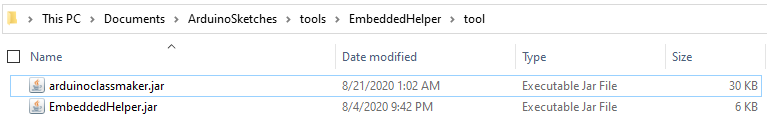
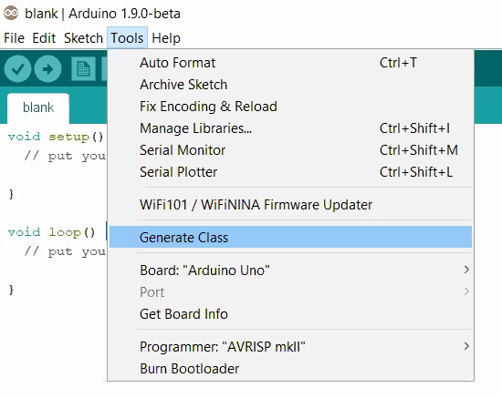

# Embedded Helper Beta Test
 

Extension to the Arduino IDE that automatically generates Arduino Classes.

<a href="http://embeddedhelper.com/">Embedded Helper Website (Web Demo Coming Soon) »</a>

## Quick start

1. **Download Arduino IDE.** This is software commonly used to program Arduino and other similar chips

      [Download Link](https://www.arduino.cc/en/main/software)

2. **Download Latest Release of this Project** In the form of two .jar files

      [Download Link](https://github.com/Embedded-Helper/EmbeddedHelperBetaTest/releases/latest)

3. **Add Jar Files to Arduino tools folder.** How to install the EmbeddedHelper Extension

  In your Arduino installation folder (usually in `Program Files (x86)/Arduino` or `Documents`), create a folder called `EmbeddedHelper` in the tools folder, then another folder in `EmbeddedHelper` called `tool`; the folders should look like `Arduino/tools/Embeddedhelper/tool/`. Copy the downloaded files from step 2 into the final `tool` folder
  
  The result will look similar to this (On Windows 10):
      
  
4. **Launch Arduino IDE** Start using EmbeddedHelper
  
  Launch Arduino IDE, and the Embedded Helper tool will show up in the `Tools` menu as `Generate Class`
      
   Now launch the Arduino Software, and the Embedded Helper tool will show up in the `Tools` menu as `Generate Class
    
   
   
   **[And please fill out our beta test feedback form to share your thoughts!](https://forms.gle/oQyqJfXD3KEXB9Zq7)**
