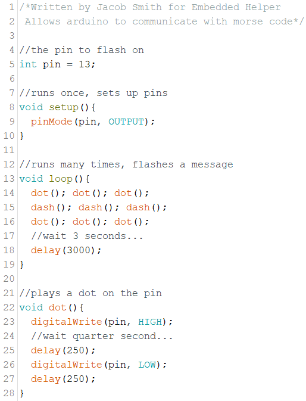
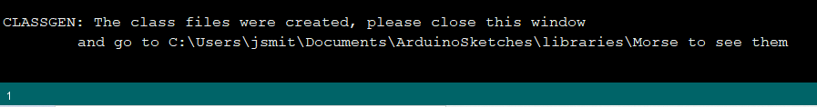

# Embedded Helper Examples

## Morse Demo

  Go to tools menu and select Generate Class, using [this Morse file](https://github.com/jsmith2021Brandeis/EmbeddedHelperBetaTest/blob/master/examples/Morse/Morse.ino) in examples folder

Select Tools --> Generate Class, and select a folder location in your libraries directory so the class will compile

​	You will receive something like the following message

​	

You can go to that location to view the generated classes!
